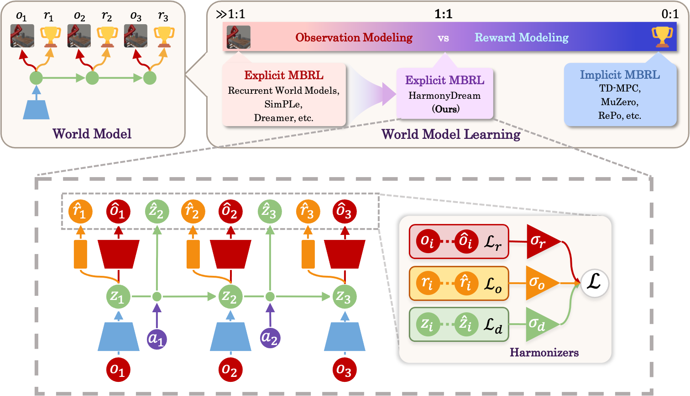
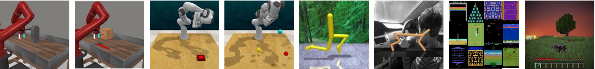

# HarmonyDream: Task Harmonization Inside World Models (ICML 2024)

Official implementation of [HarmonyDream: Task Harmonization Inside World Model](https://arxiv.org/abs/2310.00344) in PyTorch. Implementation of DreamerV2 and DreamerV3 in PyTorch are also included.

For **HarmonyDream in JAX and Atari 100K experiments**, please refer to the `dreamerv3-jax` folder and this [README](dreamerv3-jax/README.md).

## Method

**TL;DR**: We find that harmonizing domination among two tasks, observation and reward modeling, in world models can dramatically boost the sample-efficiency of model-based RL and present HarmonyDream to maintain a dynamic equilibrium between them.

<div align="center"></div>
<br/>
<div align="center"></div>

## Implementation of HarmonyDream

The implementation of HarmonyDream only involves a few lines of changes to the base method [here](wmlib-torch/wmlib/agents/dreamerv2.py). These changes can be easily applied to your own method, as listed below:
1. Add three scalar variables `harmony_s1`, `harmony_s2`, and `harmony_s3`. (line 117-119)
2. Multiply each loss by the corresponding coefficient and add the regularization term. (line 161-177)
3. Backward and update both model parameters and si using the new losses. (line 56-57)


## Dependencies

The conda environment can be created by the following command:

```
cd wmlib-torch
conda create -n wmlib python=3.9 cudatoolkit=11.3
conda activate wmlib
pip install wheel==0.38.4 setuptools==57.5.0
pip install -r requirements.txt -f https://download.pytorch.org/whl/cu113/torch_stable.html
```

**Meta-world**

Meta-world depends on [MuJoCo200](https://www.roboti.us/download.html). You need to install it manually.
Meta-world itself can be installed using the following command:

```
pip install git+https://github.com/rlworkgroup/metaworld.git@a0009ed9a208ff9864a5c1368c04c273bb20dd06#egg=metaworld
```
If an error (`ERROR: Failed building wheel for mujoco-py`) occurs during the installation, you can try down-grading cython and installing mujoco-py manually before reinstalling Meta-world:
```
pip install cython==0.29.32
pip install cffi lockfile imageio
pip install mujoco-py==2.0.2.5
```

**RLBench**

To enable headless mode, you would need to install xorg
```
sudo apt-get install xorg libxcb-randr0-dev libxrender-dev libxkbcommon-dev libxkbcommon-x11-0 libavcodec-dev libavformat-dev libswscale-dev
```

Installation and headless mode instructions of RLBench can be found in the [official README](https://github.com/stepjam/RLBench?tab=readme-ov-file#install).
Since the RLBench environment does not provide dense rewards for the Push Button task, we have implemented a custom reward function in `wmlib-torch/wmlib/envs/rb/push_button.py` following MWM.

**DMCR**

We adopt the original DMCR implementation provided by [QData](https://github.com/QData/dmc_remastered) and integrated it into our codebase. 
You need to additionally download the assets of DMCR from [here](https://github.com/QData/dmc_remastered/tree/main/dmc_remastered/assets) and move them to the `wmlib-torch/wmlib/envs/dmcr/assets` folder.

**Natural Background DMC**

We use the Natural Background DMC environment as in [RePo](https://github.com/zchuning/repo).
To train on natural background DMC, download the driving_car videos from Kinetics 400 dataset following these [instructions](https://github.com/Showmax/kinetics-downloader).
Afterwards, modify the `resource_files` (line 58) in `wmlib-torch/wmlib/envs/natural_bg_dmc.py` to point to the downloaded videos.

**MineDojo**

Please refer to the [official installation guide](https://github.com/MineDojo/MineDojo/tree/main?tab=readme-ov-file#installation) for the installation of MineDojo.
We have enabled the headless mode of MineDojo by setting `os.environ["MINEDOJO_HEADLESS"] = "1"` in `wmlib-torch/wmlib/envs/minecraft.py`.

The MineDojo environment we use is a modified version of the original environment. There are three main differences:

1. **Reward**: We use a manual dense reward function provided by [MineCLIP](https://github.com/MineDojo/MineCLIP/blob/e6c06a0245fac63dceb38bc9bd4fecd033dae735/mineclip/dense_reward/animal_zoo/dense_reward.py), which consists of a navigation reward and an attack reward.
2. **Action Space**: Since the original action space of MineDojo is too large, we have reduced the action space to 5 discrete actions, which is modified from the pruned action space of [STG-Transformer](https://github.com/zhoubohan0/STG-Transformer/blob/b57312258ee1455d8b39a2f89d092345367f2aec/minecraft/envs/minecraft_nav.py#L65).
The action space is defined as follows:

| Index | Description | Details | Num Actions |
| --- | --- | --- | --- |
| 0 | Forward and backward | 0:noop, 1:forward, 2:backward | 3 |
| 1 | Move left and right | 0:noop, 1:left, 2:right | 3 |
| 2 | Jump, sneak, and sprint | 0:noop, 1:jump, 2:sneak, 3:sprint | 4 |
| 3 | Camera delta pitch and yaw | 0:noop, 1:pitch -15degree, 2:pitch +15degree, 3:yaw -15degree, 4:yaw +15degree | 5 |
| 4 | Functional actions | 0:noop, 1:use, 2:attack | 3 |
3. **Reset Mode**: By default, MineDojo uses a _fast reset_, i.e. resets the environment using MC native command /kill, instead of waiting for re-generating new worlds. Fast reset does not change the terrain of the environment, which results in a loss of diversity.
Re-generating new worlds on every reset, on the other hand, is too slow for training. As a solution, we still use the fast reset method to reset the environment, but we also re-generate a new world every five episodes. This way, we can maintain the diversity of the environment while keeping the training speed.

During our experiments, we found that when running multiple instances of MineDojo in parallel, the environment may fail to reset due to port conflicts. To solve this issue, we let the environment randomly sleep for a short time before retrying to reset if a reset fails.
For further details, please refer to the `reset` method in `wmlib-torch/wmlib/envs/minecraft.py`.

## Experiments

### HarmonyDream

Change directory to the `wmlib-torch` folder to train HarmonyDream on different environments.

**Meta-world**

```
python examples/train_dreamerv2.py --logdir {save path} --configs metaworld --task metaworld_lever_pull --seed 0 --harmony True
```

**RLBench**

```
python examples/train_dreamerv2.py --logdir {save path} --configs rlbench plainresnet --task rlbench_reach_target --seed 0 --harmony True
```

**DMC Remastered**

```
python examples/train_dreamerv2.py --logdir {save path} --configs dmc_remastered --task dmcr_cheetah_run --seed 0 --harmony True
```

**Natural Background DMC**

```
python examples/train_dreamerv2.py --logdir {save path} --configs dmc_natural_background --task dmcnbg_cheetah_run --seed 0 --harmony True
```

**Minecraft**

Experiments on Minecraft are run using HarmonyDream applied to DreamerV3.
```
python examples/train_dreamerv2.py --logdir {save path} --configs minecraft dreamerv3 large eval_hard --task mincraft_hunt_cow --seed 0 --harmony True
```

### DreamerV2 and DreamerV3 Baselines

Our baseline methods [DreamerV2](https://github.com/danijar/dreamerv2) and [DreamerV3](https://github.com/danijar/dreamerv3) can be easily run using the following commands.

**DreamerV2**

```
python examples/train_dreamerv2.py --logdir {save path} --configs metaworld --task metaworld_lever_pull --seed 0
```

**DreamerV3**

DreamerV3 is implemented as an addon to DreamerV2, therefore we use the same entry script as DreamerV2, but with different configurations.
```
python examples/train_dreamerv2.py --logdir {save path} --configs minecraft dreamerv3 large eval_hard --task minecraft_hunt_cow --seed 0
```

## Tips

Mixed precision are enabled by default, which is faster but can probably cause numerical instabilities. It is normal to encounter infinite gradient norms, and the training may be interrupted by `nan` values. You can pass `--precision 32` to disable mixed precision.

See also the tips available in [DreamerV2 repository](https://github.com/danijar/dreamerv2).

## Citation
If you find our codebase useful for your research, please cite our paper as:

```
@inproceedings{ma2024harmonydream,
  title={HarmonyDream: Task Harmonization Inside World Models}, 
  author={Haoyu Ma and Jialong Wu and Ningya Feng and Chenjun Xiao and Dong Li and Jianye Hao and Jianmin Wang and Mingsheng Long},
  booktitle={International Conference on Machine Learning},
  year={2024}
}
```

## Contact

If you have any questions, please contact mhy22@mails.tsinghua.edu.cn (Haoyu Ma) or wujialong0229@gmail.com (Jialong Wu).

## Acknowledgement

We sincerely appreciate the following github repos for their valuable code base we build upon:

- https://github.com/danijar/dreamerv2
- https://github.com/danijar/dreamerv3
- https://github.com/younggyoseo/apv
- https://github.com/esteveste/dreamerV2-pytorch
- https://github.com/NM512/dreamerv3-torch
- https://github.com/QData/dmc_remastered
- https://github.com/zchuning/repo

The `wmlib-torch` folder is an addon to the https://github.com/thuml/ContextWM codebase.

The `dreamerv3-jax` folder is an addon to the https://github.com/danijar/dreamerv3 codebase.
